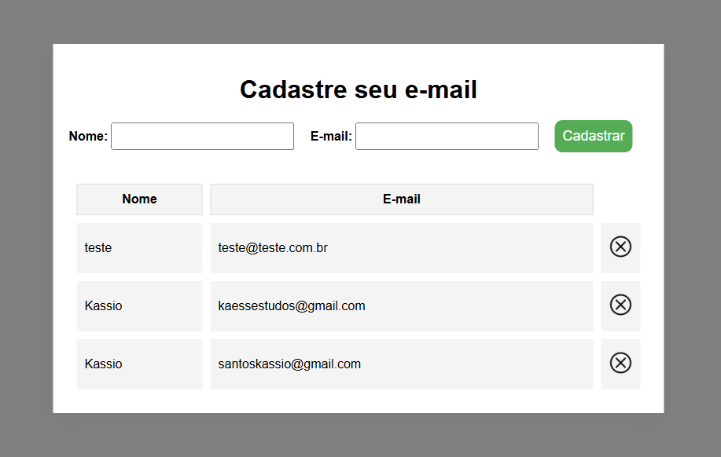

# CRUD
 
 <h1 align="center">CRUD básico de cadastro de e-mail</h1>
 
 

    
 

 ## 🚀 Tecnologias

 Esse projeto foi desenvolvido com as seguindes tecnologias:

 - HTML - CSS - JavaScript - PHP - MySQL
 - GitHub
 - Visual Studio Code

 Fiz esse projeto com o intuito de expandir minhas habilidades com as tecnologias citadas acima.

 ## :memo: Licença 

 Esse projeto está sobre a licença MIT.

